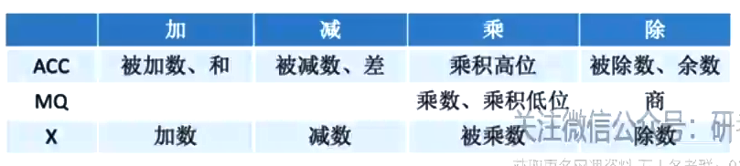
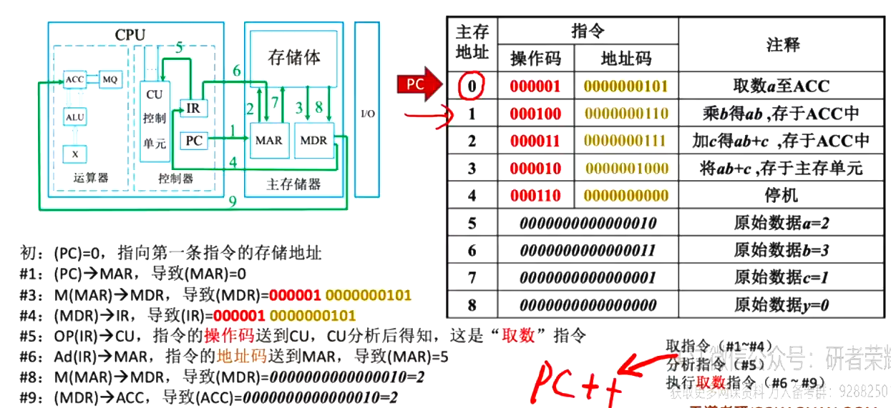
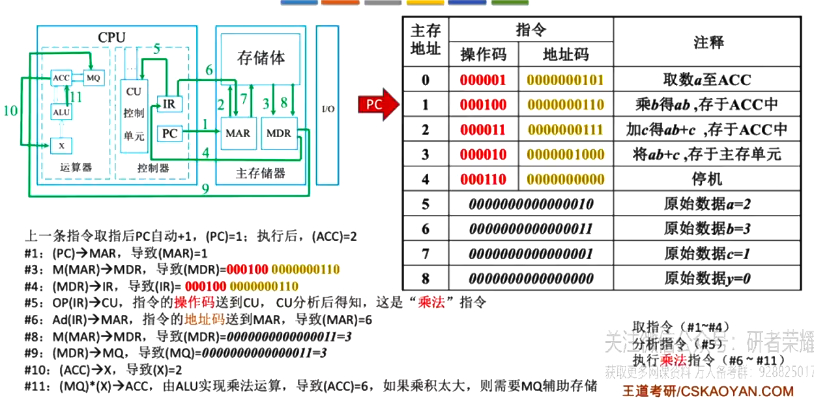
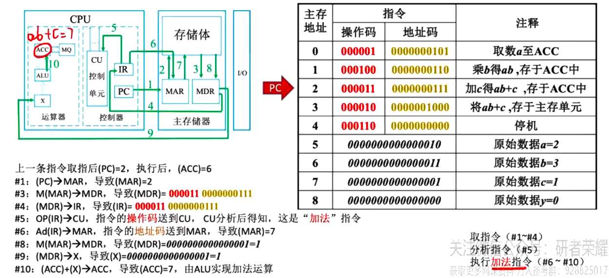
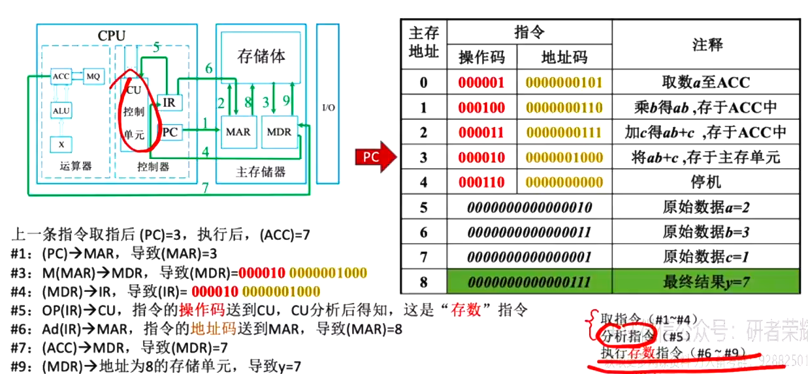
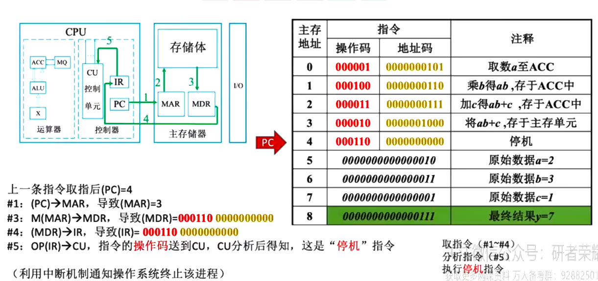

## 选择题

### 相联存储器既可以按地址寻址又可以按内容寻址， 又称**按内容寻址的存储器**

### 完整的计算机系统包括配套的硬件设备和软件系统

### 冯诺依曼机根本特征是采用**存储程序**的原理， 基本工作方式是控制流驱动的方式

### 软件和硬件具有逻辑上的等效性， 但是不等价 ， 硬件实现执行速度快，软件实现更灵活

### 地址译码器是主存的一部分， 现代计算机CPU集成地址寄存器

地址寄存器位于CPU， 但是并未集成到运算器和控制器中

### cpu是由控制器和运算器组成

CPU即中央处理器，是计算机中负责读取指令，对指令译码并执行指令的核心部件。中央处理器主要包括两个部分，即控制器、运算器，其中还包括高速缓冲存储器及实现它们之间联系的数据、控制的总线。

### 对照表

2的1次方：2
2的2次方：4
2的3次方：8
2的4次方：16
2的5次方：32
2的6次方：64
2的7次方：128
2的8次方：256
2的9次方：512
2的10次方：1024
2的11次方：2048
2的12次方：4096
2的13次方：8192
2的14次方：16384
2的15次方：32768
2的16次方：65536

### 什么是存储程序原理

存储程序原理是指将指令以代码的形式事先输入计算机主存储器，然后按照其在主存储器中的首地址执行程序的第一条指令， 以后就按照该程序规定顺序执行其他指令， 直到程序结束

所以计算机5大功能： 数据传送， 数据存储， 数据处理， 操作控制， 操作判断（控判传存处）

## 性能指标

运行时间=指令数 x CPI / 主频

计算机**运算速度**指标的含义是每秒执行多少条指令

兼容指的是计算机软件或硬件的通用性, 通常在同一系列的不同信号型号的计算机间

提升CPU主频, 扩大主存容量对性能的提升是有限度的, 采用并行技术是实现高性能计算的重要途径

吞吐量指系统在单位时间内处理请求的数量, 是评价计算机系统性能的综合参数

CPI与时钟频率无关

状态寄存器, 通用寄存器, PC 汇编程序员可见, IR, MAR, MDR 是CPU内部工作寄存器, 对程序员均不可见

主存储器: 存储体, MAR, MDR

存储单元: 每个存储单元存放一串二进制代码
存储字(word): 存储单元中二进制代码的组合(和主存储器的设计有关, 注意区分数据单位**字节**)
存储字长: 存储单元中二进制代码的位数
存储元: 存储二进制的电子元件, 存储1bit

运算器: ACC累加器, MQ乘商寄存器, X通用的操作数寄存器, ALU算数逻辑单元

控制器: CU控制单元, IR指令寄存器, PC程序计数器

完成一条指令
取指令
分析指令
执行指令

计算机的工作过程
取指令和分析指令阶段做的工作基本上是一样的

注意其中的写法:

()表示寄存器中的内容

Ad(IR)表示IR中的指令地址码
OP(IR)表示IR中的操作码
M(MAR)取主存中的二进制数据

新增指令会改变程序指令的总数

## 总结

计算机组成: 运算器, 控制器, 存储器, 输入设备, 输出设备

现代计算机以存储器为中心, 使IO操作尽可能绕过CPU

CPU主频表示CPU内数字脉冲信号振荡的速度, 主频和实际运算速度有一定关系. CPU的运算速度还要看CPU的流水线的各个方面的性能指标(架构, 缓存, 指令集, CPU位数, Cache大小等)
