## 进制

二进制的小数只能表述$1/2, 1/4, 1/8, ..., 1/2^{n}$

## BCD码(Binary-Coded Decimal)

8421 越界之后 + 6 进行修正
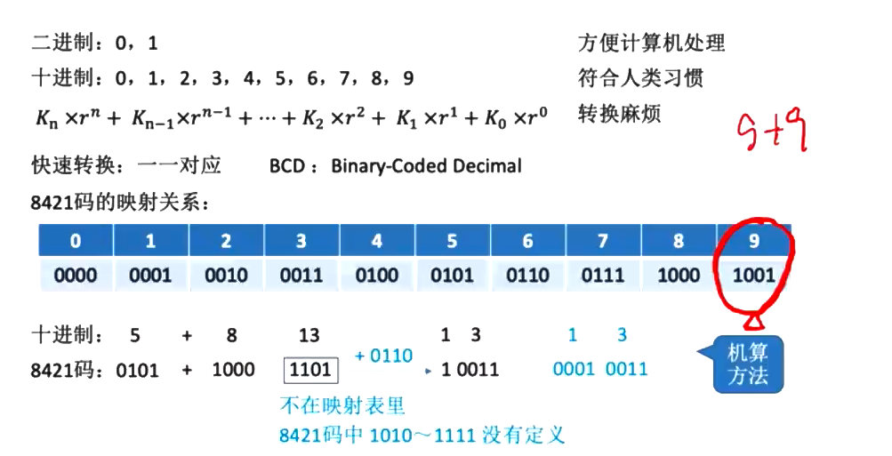

余3码是无权码

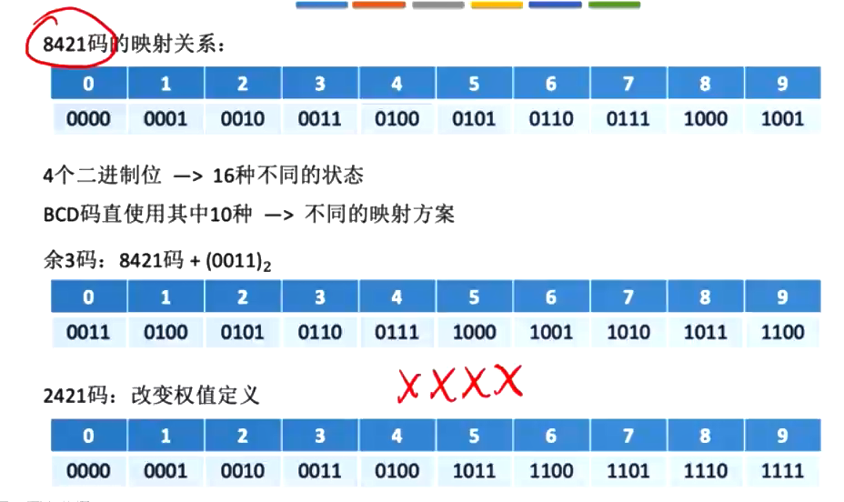

## ASCII

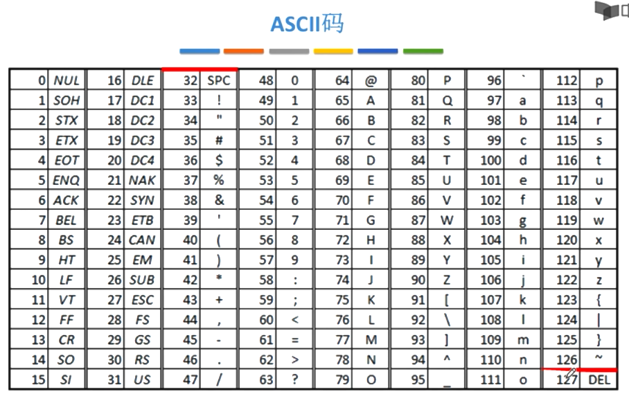

可印刷字符: 32 ~ 126, 其余为控制, 通信字符

0-9: 48 (0011 0000) - 51 (0011 1001) 8421 码规则

运用这个规律直接写出字母的ASCII码

大写字母: 65 (0100 0001) - 90 (0101 1010) 二进制数字的1-26

小写字母: 65 (0110 0001) - 90 (0111 1010) 二进制数字的1-26

## 汉字的表示和编码

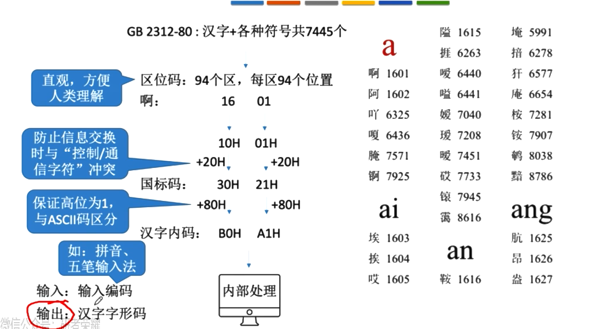

+20H是避免与控制和通信字符冲突(满足数据传输的要求, 但是存储到计算机会和ASCII码冲突)
+80H避免和ASCII码冲突

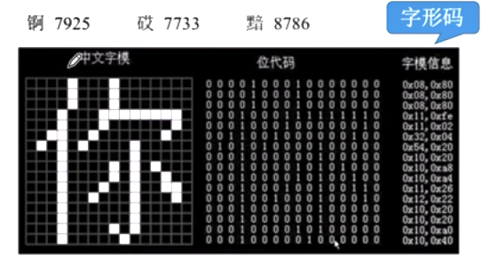

## 字符串

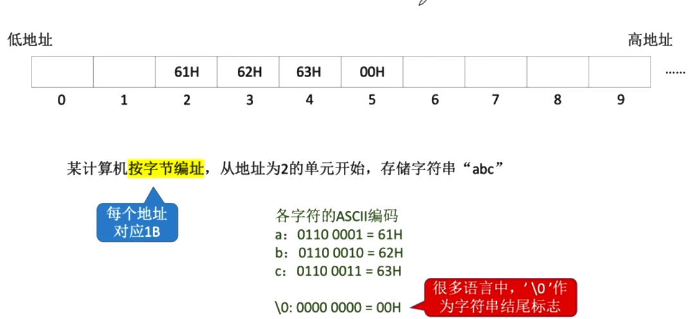

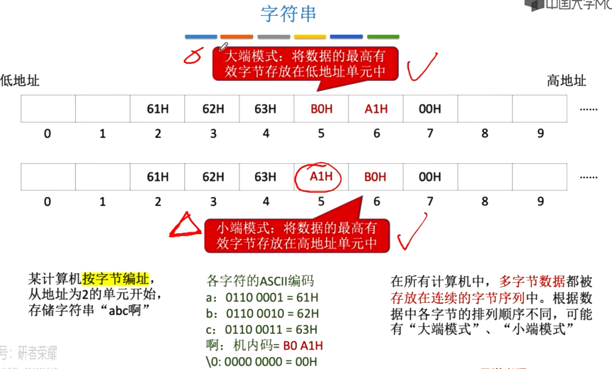

## 奇偶校验码

注意码距的概念: 合法码字间最小距离称为**码距**

码距越大, 检错纠错能力越强

奇校验, 校验码中1的个数为奇数

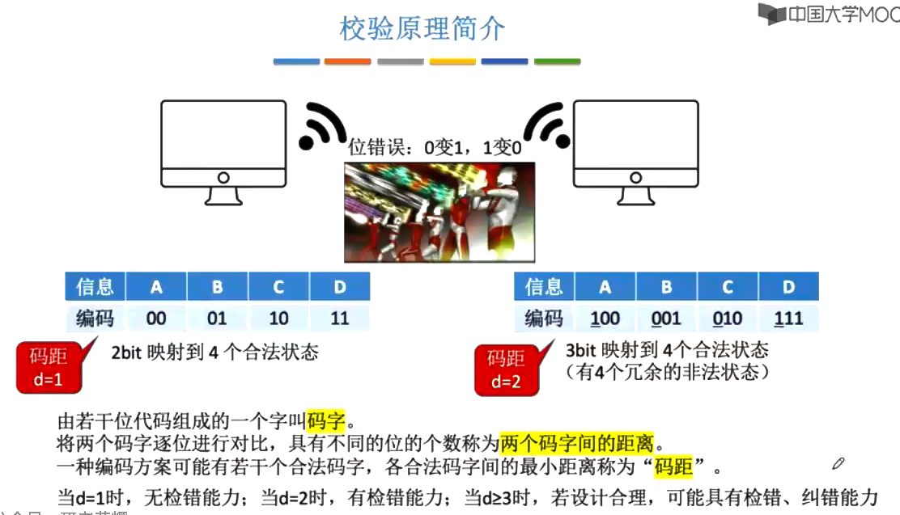

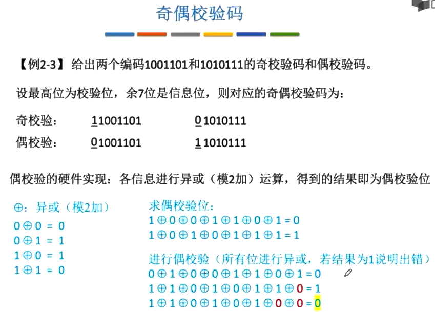

## 海明码

设计思路: 将信息为分组进行偶校验->多个校验位->多个校验位标注出错误

海明码具有1位纠错能力, 2位检错能力

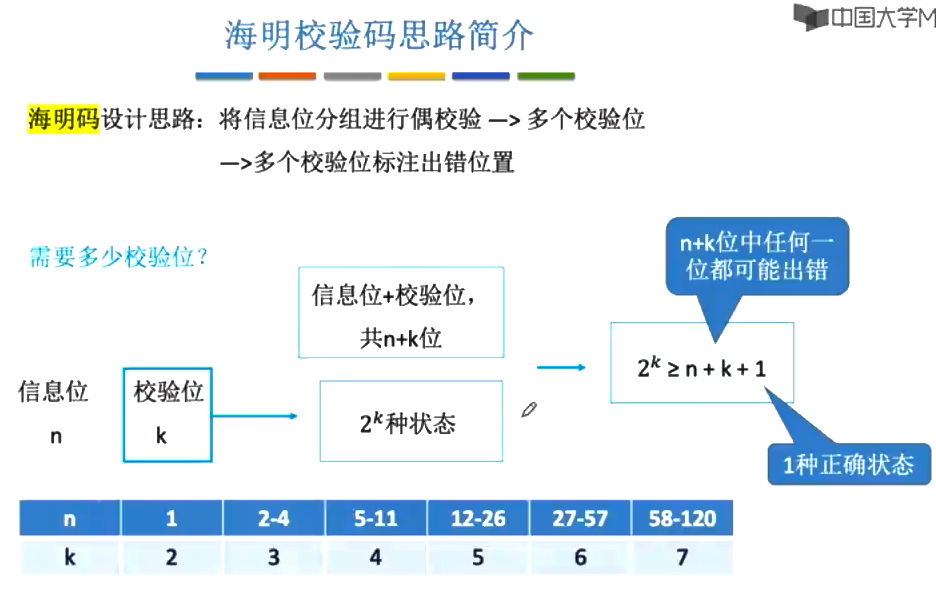

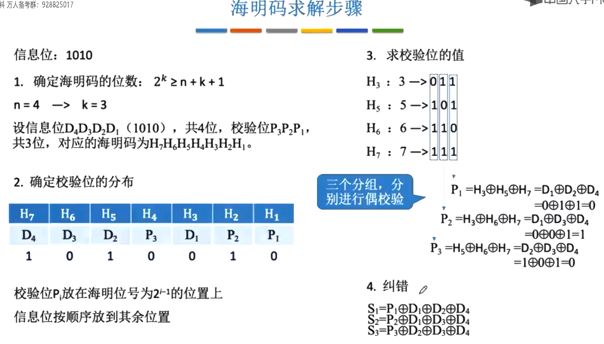

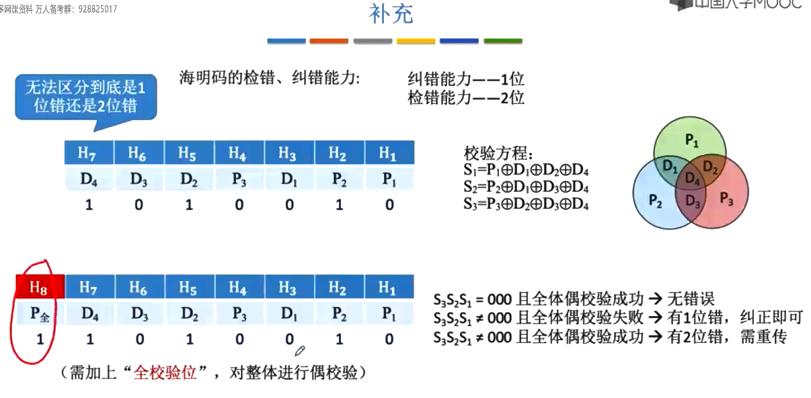

加上全校验位之后需要满足等式$2^{k-1} >=  n + k + 1$

## 循环冗余检验码

只看最高位, 模二减和异或运算是一样的

生成多项式最高次幂位R, 移位为R

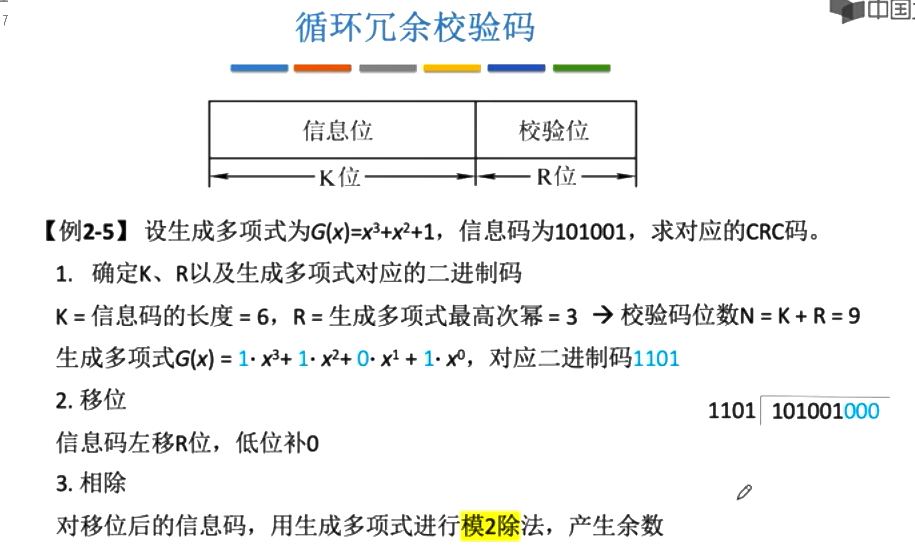

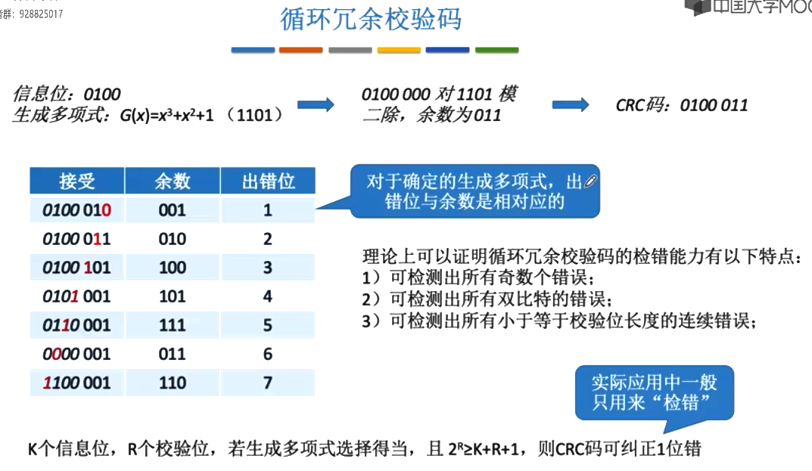

## 定点数和浮点数(小数点的位置, 常规计数和科学计数法)

* 无符号数
* 有符号数
  * 原码
  * 反码
  * 补码
  * 移码

### 无符号数

通常只有整数没有小数(对应c语言中没有 unsigned float)

0 ~ 2^{n} - 1
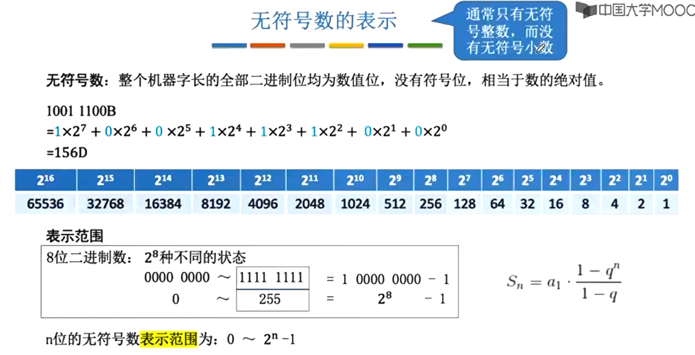

### 有符号数

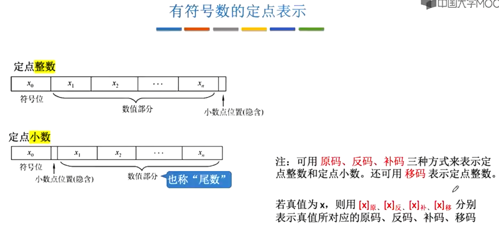
