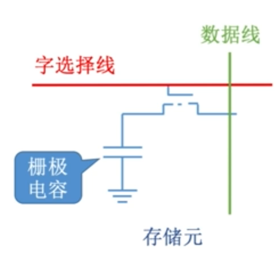
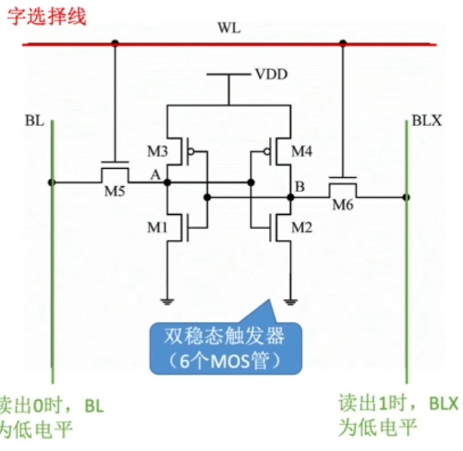

74LS138译码器(使能信号 100, 38译码器)

## 只读存储器(ROM)

广义的只读存储器已可通过电擦除等方式进行写入, 只读概念不存在, 但是仍然保留断电内容保留, 随机读取的特性, 但是写入速度比读取速度慢得多

## 存储器分级方式是为了解决容量, 速度, 价格三者之间的矛盾

## 易失性

断电后信息消失

## 为什么要用行列地址

减少选通线的数量

### 刷新

以行为单位, 逐行刷新, 整个存储器所有的行都要被刷新

单独的硬件支持, 占用1个读写周期

默认刷新周期2ms

* 分散刷新()

## DRAM

栅极电容

成本低, 集成度高, 功耗低

电容内存储的电荷只能维持2ms, 即使不断电, 也会消失

## SRAM

双稳态触发器

成本高, 集成度低, 功耗高

## 送行列地址

SRAM: 同时送
DRAM: 分两次送(DRAM容量比较大, 简化电路设计, 公用地址线)

## 地址线复用技术

即

DRAM: 分两次送(DRAM容量比较大, 简化电路设计, 公用地址线)

采用的是行列地址线复用技术, 尽量选择行列差值不要太大, DRAM, 最好行值小于列值, 以减少刷新开销

## SDRAM

## 字扩展

地址线的高位作为译码器的输入  

## MAR寄存器和MDR寄存器

MAR: 用来存放当前CPU访问的内存单元地址, 或者存放CPU写入内存的内存单元地址.

MDR: 用来存放有内存中读出的信息或者写入内存的信息

## 存储阵列

存储阵列的引脚数总数和存储容量是一一对应的

## 主存与CPU, cache交换数据的单位

cache 块, 也被称为(原因, 把CPU访问地址周围的部分数据放到Cache中)

CPU 字

## 近期最少使用算法(LRU)

1. ①命中时，所命中的行的计数器清零，**比其低的计数器加1，其余不变**；
2. ②未命中且还有空闲行时，新装入的行的计数器置0，其余**非空闲行全加1**；
3. ③未命中且无空闲行时，计数值最大的行的信息块被淘汰，新装行的块的计数器置0，其余全加1

## LFU算法

LFU算法——曾经被经常访问的主存块在未来不一定会用到（如：微信视频聊天相关的块），并没有很好地遵循局部性原理，因此实际运行效果不如LRU

## Cache写策略

## Cache与主存的映射关系

Cache 需要记录数据: 有效位 标记(对应的主存地址)

### 组相联

访存: 主存块号 + 块内地址

所属分组=主存块 % 分组数 (分组数如果是 $2^{n}$), 主存块号最后n为就是块号, 查找很快

## 虚拟存储器

虚拟存储器有段式(以**段**为单位), 页式, 段页式(以**页**为单位)

## 地址译码器

主存等存储器的组成部分
